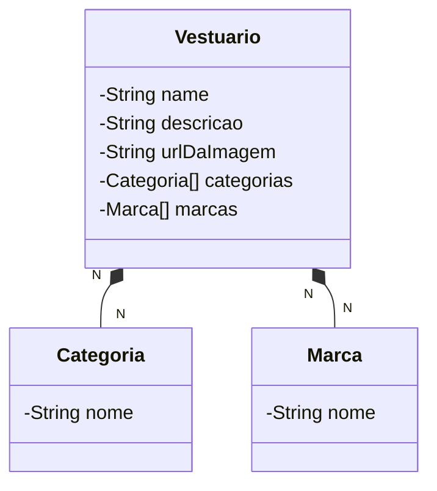

## Ferramentas e tecnologias utilizadas

- java 17;
- Spring Boot 3;
- Lombok
- Springdoc (Swagger)
- Postgres
- H2 Database
- Railway
- vscode

## Descrição básica
- Esta api visa criar um Back-end de uma aplicação de gerenciamento de peças de um vestuário com base na categoria e marca do produto.

## Diagrama de classes

## Acesso a API

### acessar o console do h2 database 
- http://localhost:8080/h2-console

### acessar a url no swagger Localmente
- http://localhost:8080/swagger-ui/index.html

### acessar a aplicação online no Railway
- catalogovestuario-production.up.railway.app/swagger-ui/index.html#/

### json online edit
- https://jsoneditoronline.org/

## Estrutura de pacotes do projeto

| Pacote          | Descrição                                                                    |
| --------------- | --------------------------------------------------------------------------   |
| controller      | Classes que gerenciam as requisições da API                                  | 
| model           | Entidades do domínio da aplicação                                            |
| repository      | Inteface de acesso a base de dados                                           |
| service         | Classes com regras de negócio   

